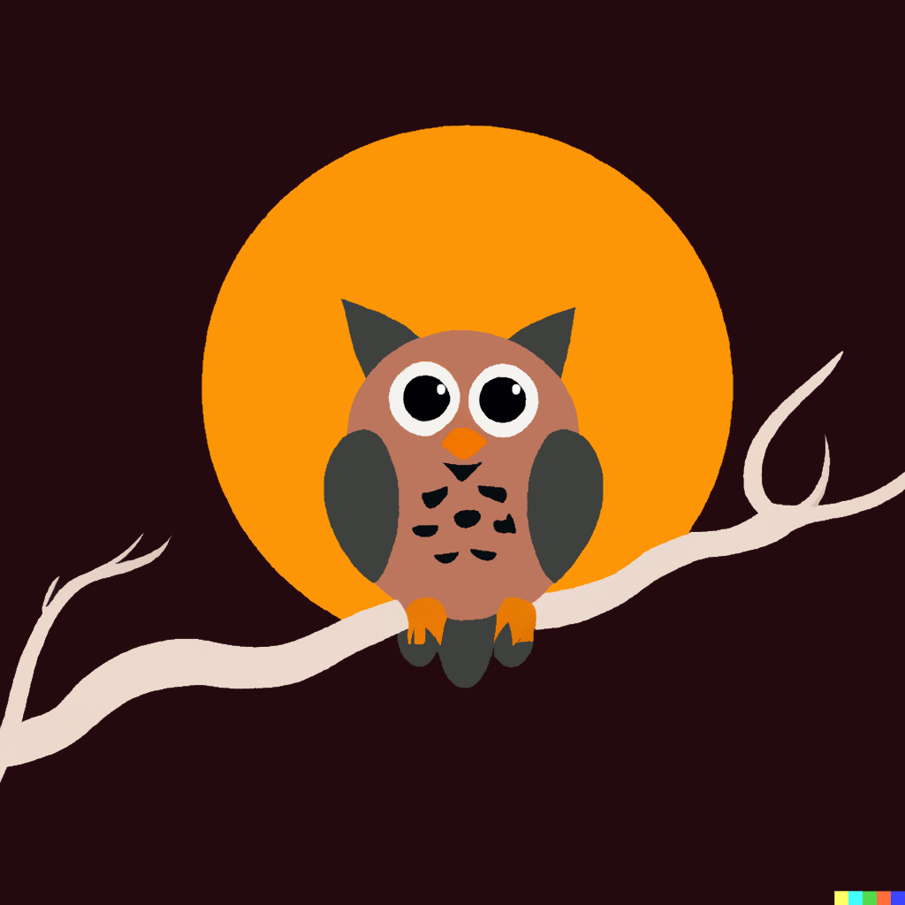

# noc·tur·nal
/nɑkˈtɜnəl/

_adjective_
 
&nbsp;&nbsp;done, occurring, or active at night.

 

 

**what is it?**

an Mv3 browser extension to add dark mode back to google websites

 

**Which sites are supported?**

- [x] google classroom
- [x] google domains
- more coming soon

 

**installation instructions**

1. download the [latest release](https://github.com/imaperson1060/nocturnal/releases/latest)
2. extract the zip file into a permanent location (i.e. your documents folder)
   - if the extracted folder is moved, the extension will stop working
3. in your browser, go to `[browsername]://extensions` (i.e. `chrome://extensions`, `edge://extensions`)
4. enable the developer mode toggle
5. click "Load unpacked"
6. select the location of the extracted folder

 

**please [report](https://github.com/imaperson1060/nocturnal/issues) any visual issues you find**

 

**[concept credit](https://chrome.google.com/webstore/detail/google-classroom-dark-mod/gkmfklmmoioijpjndhdhogcefdbfcfho)**
